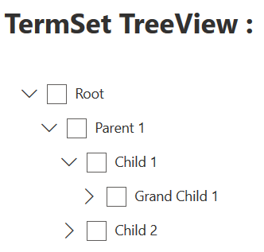

# SPFx--dev--WebParts
SharePoint Framework WebParts samples

# SharePoint Framework Client-Side Web Part Samples

This repository contains samples Client Side Web Parts built on the SharePoint Framework SPFx.

> These WebParts are mainly based on best-class jQuery, React or Angular plugins and use the [sp-client-custom-fields library](https://github.com/ismailmessaoud/sp-client-custom-fields) to optimize the edit experience.
And Yes, these web parts are free and open source, so have fun well to build effective SharePoint site.


## Have issues or questions?

Please use following logic on submitting your questions or issues to right location to ensure that they are noticed and addressed as soon as possible.

* You have any question, - use can [read the FAQ](https://github.com/ismailmessaoud/SPFx--dev--WebParts/wiki/FAQ).
* You have issue on specific web part or sample - use [issue list in this repository](https://github.com/ismailmessaoud/SPFx--dev--WebParts/issues).

## Video & Audio

Overview |  Web Part |  Description
------------ | ----------- | -----------
 | [**TermSet TreeView**](https://github.com/ismailmessaoud/SPFx--dev--WebParts/wiki/TermSet-TreeView) |  This Web Part return a SharePoint TermSet into a tree structure. You can select the TermSet from the WebPart properties and you'll see the the render of this TermSet in a TreeView Strucre.


## Using the samples

To build and start using these projects, you'll need to clone and build the projects.

Clone this repository by executing the following command in your console:

```shell
git clone https://github.com/ismailmessaoud/SPFx--dev--WebParts.git
```

Navigate to the cloned repository folder which should be the same as the repository name:

```shell
cd SPFx--dev--WebParts
```

To access the samples use the following command, where you replace `sample-folder-name` with the name of the sample you want to access.

```shell
cd samples
cd sample-folder-name
```

Now run the following command to install the npm packages:

```shell
npm install
```

This will install the required npm packages and dependencies to build and run the client-side project.

Once the npm packages are installed, run the following command to preview your web parts in SharePoint Workbench:

```shell
gulp serve
```

## Additional resources

* [Overview of the SharePoint Framework](http://dev.office.com/sharepoint/docs/spfx/sharepoint-framework-overview)
* [SharePoint Framework development tools and libraries](http://dev.office.com/sharepoint/docs/spfx/tools-and-libraries)
* [SharePoint Framework Reference](http://aka.ms/spfx-reference)
* [Visual Studio Extension for SharePoint Framework projects](https://github.com/SharePoint/sp-dev-fx-vs-extension)


## The MIT License (MIT)

Copyright (c) 2020 Ismail Messaoud
Permission is hereby granted, free of charge, to any person obtaining a copy of this software and associated documentation files (the "Software"), to deal in the Software without restriction, including without limitation the rights to use, copy, modify, merge, publish, distribute, sublicense, and/or sell copies of the Software, and to permit persons to whom the Software is furnished to do so, subject to the following conditions:

The above copyright notice and this permission notice shall be included in all copies or substantial portions of the Software.

THE SOFTWARE IS PROVIDED "AS IS", WITHOUT WARRANTY OF ANY KIND, EXPRESS OR IMPLIED, INCLUDING BUT NOT LIMITED TO THE WARRANTIES OF MERCHANTABILITY, FITNESS FOR A PARTICULAR PURPOSE AND NONINFRINGEMENT. IN NO EVENT SHALL THE AUTHORS OR COPYRIGHT HOLDERS BE LIABLE FOR ANY CLAIM, DAMAGES OR OTHER LIABILITY, WHETHER IN AN ACTION OF CONTRACT, TORT OR OTHERWISE, ARISING FROM, OUT OF OR IN CONNECTION WITH THE SOFTWARE OR THE USE OR OTHER DEALINGS IN THE SOFTWARE.
